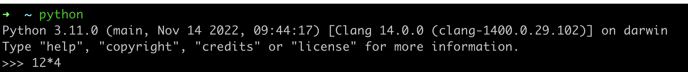

# Numbers

Read through the following expressions and predict the _value_ and _data type_ of each one - e.g. is it a string, integer, or float?

Justify your prediction and then use Python to check if you were correct.

Make sure you understand why you got the results you did and investigate any that surprised you. You can use the [Python documentation](https://docs.python.org/3/).
[Speedsheet](https://speedsheet.io/s/python) for Python is also useful for quick reference.

You can use the Python REPL to try out these exercises. Just type `python` at the command line prompt. Then type the Python command shown at the prompt, like this:

</img>


A: 
```python
12*4
```


B: 
```python
3*0.1
```


C: 
```python
0.1+6
```


D: 
```python
11.3-10
```


E: 
```python
13%2
```


F: 
```python
13%2.0
```


G: 
```python
2**8
```


H: 
```python
11+9
```


I: 
```python
6/10
```


J: 
```python
19//10
```
